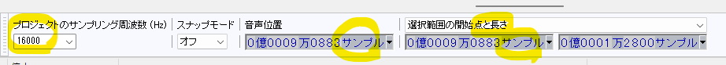

****************************************
Audacity を利用したじゃんけん6音声の録音
****************************************

はじめに
---------

かいつまんで説明します．

本実験では Audacity を用いて，学習用の音声ファイルを収録する．
収録条件は以下の通り．

- 音声ファイルの形式

  - フォーマット: WAV形式

  - エンコード: PCM, 16-bit signed integer, Little Endian

- 音声データの諸元

  - チャネル数: 1 ch (モノラル)

  - サンプリングレート: 16,000 Hz

  - 音声長: 0.8 sec (12,800 sample)　※1音声あたりの長さ

※演習室環境では，やや古い Audacity 2.3.3 を利用します．
最新版 (version 3.3.3; 2023.10.19現在) では，一部UIの表記が変わっているかもしれません．
自分のPCにインストールして自習するという人は，適当に読み替えながら，取り組んでください．

起動と下準備
-------------

- Audacity を起動する．

  - 録音デバイス（マイク型アイコン付近）を確認する．

    - 演習室なら ALSA を選ぶ．
    - 自習用PCが Windows 10/11 なら Windows WASAPI が良い．
    - macOSは，なんかいい塩梅のデバイスが選ばれていたはずです．詳しくは知りません・・・

- 録音デバイスの隣あたりに、チャンネル数の設定があるので、「モノラル 1ch」を選ぶ

- 画面左下，プロジェクトのサンプリング周波数を 16,000 Hz にする．

まずはここまで．

いったん，プロジェクトとして「保存」しましょう．拡張子は ``.aup`` です．
例えば，``janken.aup`` など，思い出しやすいファイル名をつけておきましょう．

録音
--------

さっそく，録音をしましょう．

- 赤い丸で録音開始！ じゃんけんの音声を 6 つ録音しよう．ポイントは 4 つ．

  - 各音声（ぐー，など）が 0.8 秒ぐらいの長さに収まるようにする

  - 各音声の間に 1 秒ぐらいの無音を確保しておくと，後でラベル区間をつけやすい．

  - 最終音の後の無音も忘れずに．（話し終わって，一呼吸おいてから停止しよう．）

  - 振幅が 0.4 を全く超えていないのであれば，さすがに声が小さすぎる．

*トラブルシューティング*

- 録音に失敗した場合

  - 録音と再生 --> 録音 --> パンチ＆ロール（Shift + D）が便利です．
  - Shift + D でカーソル位置の５秒前から，音が再生され，カーソル位置にたどり着くと録音される．
  - 残念ながら，パンチイン＆アウト [#pio]_ ではありません．カーソルから後ろの音がすべて消えます．要注意！

- ステレオ（2 ch）で録ってしまった場合

  - 『トラック --> ミックス --> ステレオからモノラルへ』でモノラル(1 ch)化することができます。

以上です．

Audacityの中で，6音声を1つの長い音声波形として収録してください．

.. [#pio] パンチイン＆アウトは，録音現場で使われることの多い（？）機能で，カーソル位置に挿入するような操作です．

Audacity の設定の再確認
------------------------

収録を終えたら，次の作業に移る前に，設定項目を再確認しましょう．

画面下部のUIで，以下の変更・確認をしてから作業しましょう．

- 「音声位置」を「サンプル」単位に変更
- 隣のセレクトボックスで「選択範囲の開始点と長さ」を選択　※「長さ」を見えるようにすることが重要です！！
- （念のため）プロジェクトのサンプリング周波数 (Hz) が 16,000 になっていることを確認

    Audacity 下部のツールバーによる設定

音声区間のラベル付け
------------------------

収録と設定を終えたら，6音声に対して，音声区間のラベル付けをします．

やりたい作業は，こんな感じです．

- 範囲選択機能を使って，ぴったり **0.8 秒 (12,800 sample)** を選択する． ※英語UIなら sample，日本語UIならサンプルという表記

  - マウスドラッグで，ざっくりと１つ分の発声区間を範囲指定

  - 信号長がおよそ12,800 サンプルに，かつ，音声波形がおよそ中心に位置するよう，選択範囲を拡大縮小します [#lr_arrow]_．

    - マウスで選択範囲の境界線を掴むイメージで，選択範囲の拡大縮小ができます．
    - 12,800 ± 1,000 サンプルぐらいを目安に動かしてください．後で微調整するので，アバウトでOKです．

  - 最終調整として，「選択範囲の開始点と長さ」で，右側の数値（つまり，長さの指定）で，12,800 点を指定する．

    - English UI では「**12,800 sample**」です．
    - Japanese UI では「**1万2800サンプル**」です [#oh_no_jap]_．

- 編集 --> ラベル --> 選択範囲にラベルを付ける (Ctrl + B)．

  - わかりにくいが，下図の丸を付けた個所がテキストの入力エリア

    .. figure:: _static/img/audacity_labeling_1.png
        :scale: 80%

        Audacity ラベル入力の図(1)

  - 例えば，``Jan_Goo_1`` などの文字にしておく．（ジャンケンのグーの1回目という意味）

    - このラベル文字列は，後でwavファイル名にも使われる．
    - 念のため，繰り返します．1音声は 12,800 sample にしましょう．

    .. figure:: _static/img/audacity_labeling_2.png
        :scale: 80%

        Audacity ラベル入力の図(2)

- 以上を6音声に対して繰り返す．

  - Jan_Goo_1, Jan_Goo_2, Jan_Chk_1, Jan_Chk_2, Jan_Par_1, Jan_Par_2

    .. figure:: _static/img/audacity_labeling_3.png
        :scale: 80%

        Audacity ラベル入力が終わった状態の例

.. [#oh_no_jap] 間違ってはいないが，プログラマならば，もやもやする翻訳ですよね．12.8k = 12,800 です．
.. [#lr_arrow] 「Shift + 矢印キー」や「Ctrl + Shift + 矢印キー」で，選択範囲を拡大・縮小できるのですが・・・この方法では，ぴったりの数字にはできません．

ここまで終えたら，忘れずに **プロジェクトの（上書き）保存** をしておきましょう．

WAVファイルへの export
------------------------

6音声すべてにラベル付けを終えたら，最後は WAV ファイルの export です．

- ファイル --> 書き出し --> 複数ファイルの書き出し

  - フォルダを指定する　※例えば，~/jikkenB/wav など．~は自分のホームディレクトリ（/home/users/ecs/(学生番号)/）のこと．
  - ファイル分離基準は「ラベル」
  - ファイルの命名は「ラベル/トラック名の利用」

これで，指定したフォルダにファイルが作られているはずです．

「端末 (``gnome-terminal``) [#terminal]_」 を開き，確かめてみましょう．
(``$`` より前はプロンプトです．)

少なくともファイルサイズが同じことを確認しておいてください [#soxi]_．

収録環境によっては，256044 byte などになっているかもしれません．
そのような場合でも，``soxi`` の出力で 1 ch, 16 bit, 12800 sample が
確認できていれば，おそらく問題ありません．

.. code-block:: bash

    $ ls -la ~/jikkenB/wav

    # 以下，実行例
    [hara@D001 ~]$ ls -la ~/jikkenB/wav
    合計 204
    drwxr-x---  3 hara staff  4096 10月 11  2023 .
    drwxr-x--- 13 hara staff  4096 10月 19 14:05 ..
    -rw-r-----  1 hara staff 25736 10月 11  2023 Jan_Chk_1.wav
    -rw-r-----  1 hara staff 25736 10月 11  2023 Jan_Chk_2.wav
    -rw-r-----  1 hara staff 25736 10月 11  2023 Jan_Goo_1.wav
    -rw-r-----  1 hara staff 25736 10月 11  2023 Jan_Goo_2.wav
    -rw-r-----  1 hara staff 25736 10月 11  2023 Jan_Par_1.wav
    -rw-r-----  1 hara staff 25736 10月 11  2023 Jan_Par_2.wav

.. code-block:: bash

    $ soxi ~/jikkenB/wav/Jan_Goo_1.wav

    # 以下，実行例
    [hara@D001 ~]$ soxi ~/jikkenB/wav/Jan_Goo_1.wav

    Input File     : '/home/users/ecs/hara/jikkenB/wav/Jan_Goo_1.wav'
    Channels       : 1
    Sample Rate    : 16000
    Precision      : 16-bit
    Duration       : 00:00:00.80 = 12800 samples ~ 60 CDDA sectors
    File Size      : 25.7k
    Bit Rate       : 257k
    Sample Encoding: 16-bit Signed Integer PCM

.. [#terminal] Jupyterのコンソールではありません．Linuxの端末アプリ（実態は，``gnome-terminal`` コマンド）です．
.. [#soxi] 演習室環境以外では ``soxi`` コマンドが存在しないでしょう．Ubuntu/WSLなら，``sudo apt install sox`` でインストールできます．

最後に
-------

最後に，もう一度 Audacity のプロジェクト(``janken.aup`` 等)を保存しておくとよいでしょう．

後でラベル修正だけする，みたいなことが簡単にできます．

Exportした音声ファイルのバックアップを取ろう（任意）
----------------------------------------------------

作業中に誤って音声ファイルを消してしまうかもしれません．
念のため，バックアップを取っておくのもよいでしょう．
Windowsでも使いたいなら zip アーカイブを作るのが無難です．
Linuxの伝統(?)にしたがうなら tar.gz (tgz) がおすすめです．

ZIPアーカイブを作る場合
~~~~~~~~~~~~~~~~~~~~~~~~~~

作成も展開も，常に第1引数が zip ファイル名です．

zipファイル作成：

.. code-block:: bash

    cd ~/jikkenB
    
    # If you make .zip archive file
    zip -r janken_wav_20231114.zip wav/

zipファイルの中身を確認：

.. code-block:: bash
  
    unzip -l janken.zip

zipファイルを展開：

.. code-block:: bash
  
    unzip janken.zip

TAR.GZアーカイブを作る場合
~~~~~~~~~~~~~~~~~~~~~~~~~~

第1引数の先頭の文字に注目してください．C=Create, T=Test, X=eXtract です．

また，作成も展開も，常に第2引数が tgz ファイル名です．

tgzファイル作成：

.. code-block:: bash

    cd ~/jikkenB
    
    # If you make .tgz(.tar.gz) archive file
    tar czvf janken_wav_20231114.tgz wav/

tgzファイルの中身を確認：

.. code-block:: bash
  
    tar tvf janken_wav_20231114.tgz

tgzファイルを展開：

.. code-block:: bash
  
    tar xvf janken_wav_20231114.tgz

Audacityプロジェクトのバックアップを取ろう（任意）
---------------------------------------------------

- Audacityで保存される aup ファイルは，音声データそのものではない．
  例えば，``janken.aup`` というファイル名で保存すると，同じディレクトリに，
  ``janken_data`` というディレクトリが作られる．
    
- ``janken_data`` の中に，元の音声データ(``.au``)を含め，様々な情報が格納される．
  そのため，自宅環境に移すためにアーカイブファイルにまとめておきたい，とか，
  Moodleのファイル置き場にバックアップしておきたいならば：
    
  .. code-block:: bash
    
      zip -r janken.zip janken.aup janken_data/
    
  で，``janken.zip`` のようなアーカイブファイルにまとめておくとよい．
    
- なお，最新版のAudacityではプロジェクトファイルの仕様が変更されており，
  互換性がなくなる可能性があります・・・
  6音声全部入りのwavファイルをexportして，ラベルを振り直す，という方法が
  簡単かもしれません．

DISCLAIMER
------------

ここでは，講義を進める上での必要最小限の設定のみ説明しています．

例えば，「歌ってみた」い人に最善の設定ではありません．

詳しい人は，もっと良い設定にしてから録音してもらえたら，，，と思います．
