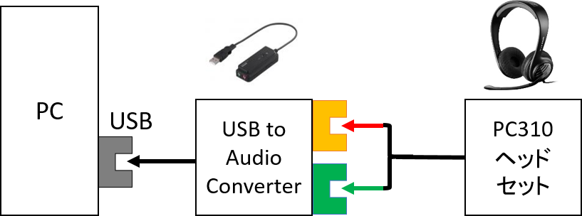
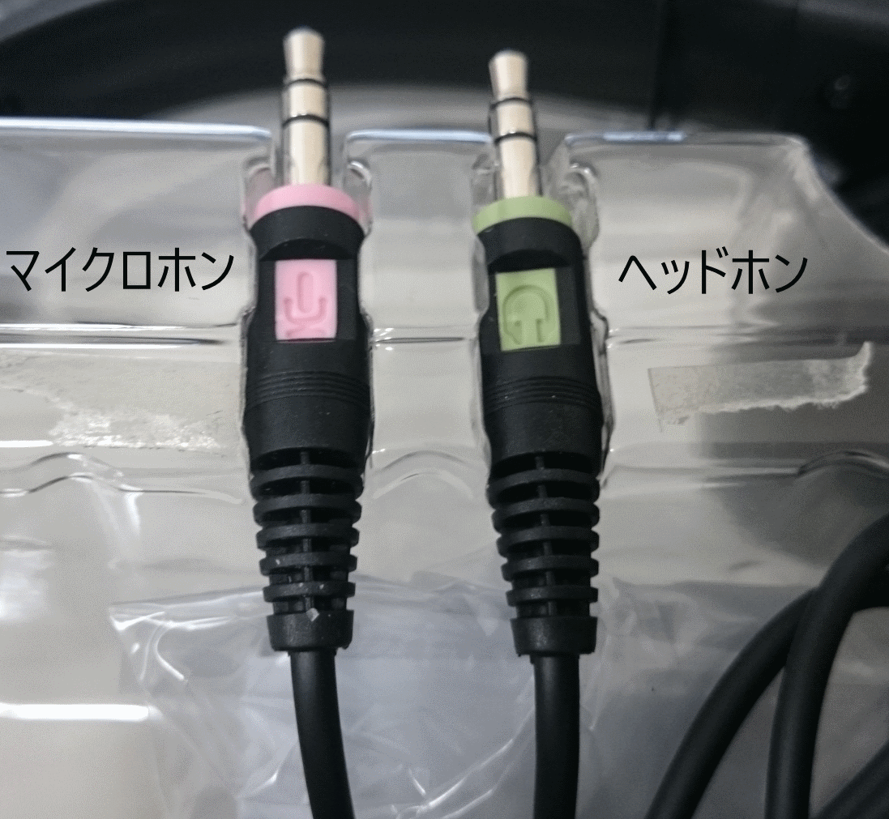
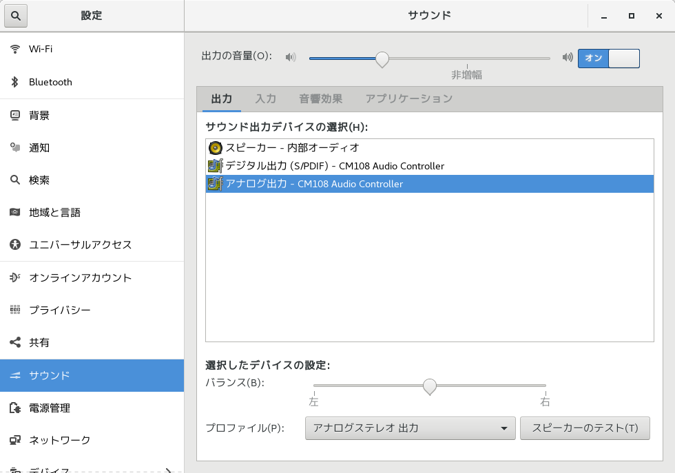
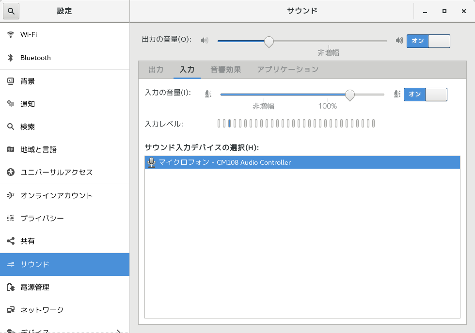
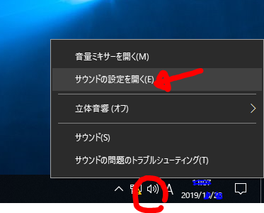
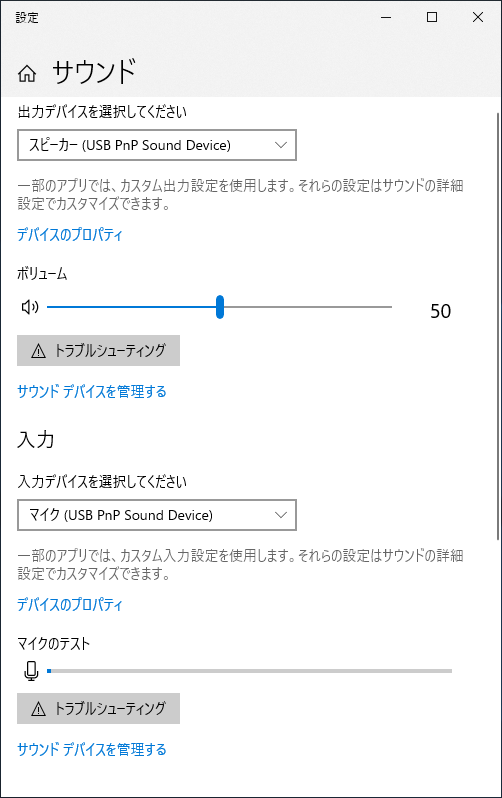

******************************
ヘッドセットマイクロホンの利用 
******************************

.. _SM_summary:

要約 / Summary
-----------------------

本講義では，ヘッドセットマイクロホン（Senheiser PC310）を利用します．
このヘッドセットマイクロホンには，コンデンサマイクロホンと呼ばれる精密電子機器が搭載されています．
不用意な取扱いによって故障を引き起こさないよう，十分に注意しましょう．

**マイクロホン部分の扱いについては，SP-2以降で説明します．**
**今回は，単なるヘッドホンとして利用してください．**

--------------

.. _SM_caution:

扱いについての注意 / Cautions
------------------------------------

.. raw:: html

   

     <i class="fas fa-exclamation-circle" aria-hidden="true"></i>
     注意
     マイクロホンは精密電子機器です．丁寧に扱うようにしてください． 
     乱暴な扱いを発見した場合，その場で回収する場合があります．
   

以下の行為は，厳禁です．やりがちな行為が，実はアウトだったりしますので，よく読んでおきましょう．

-  端子の抜き差しの際にケーブルを引っ張る

   -  断線します．必ず，コネクタ部分を持って，抜き差ししてください．

-  ケーブル部分やマイクブーム（アーム）でヘッドセット本体を持ち上げる．

   -  断線したりブームが折れます．ヘッドバンド，あるいはハウジング部分を持って，支えてください．

-  ケーブルの上にモノを置く．

   -  断線します．

-  音量チェックのために，マイクロホン部分を叩く．

   -  コンデンサマイクロホンは，微小な振動も拾うことで，小さな音を取り込めるようにしています．
   -  一方，大きな音（＝振動）には弱いです．例えば，カラオケ用のマイクと比べれば，圧倒的に弱いです．

-  音量チェックのために，マイクロホン部分に息を吹きかける．

   -  マイクロホンは湿気に弱いです．最悪，カビます．
   -  利用時に，多少息がかかるのは仕方がありません．意図的にやらないように，ということです．

--------------

.. _3a-3-connect-it:

Connect it!
-----------------

PCに搭載されているオーディオボードは，あまり性能が良くないことがあります．
本講義では，オーディオボード相当のUSBドングル（iBuffaloBSHSAU01BK）を用意しています．

早速，PCにつないでみましょう．接続先を間違えないように．

    配線図

    PC310の2つのミニプラグ（3.5mm; 赤：録音用，緑：再生用）

--------------

.. _3a-4-デバイスの選択と音量調節:

デバイスの選択と音量調節
------------------------------

(a) Linux (Gnome desktop on Cent OS) の場合
~~~~~~~~~~~~~~~~~~~~~~~~~~~~~~~~~~~~~~~~~~~

講義室のLinux上では，\ ``gnome-control-center``\ コマンドを使って，再生・録音デバイスを選択したり，音量調節をすることができます．
端末で，あるいは，\ ``Alt + F2``
を押した後の入力ボックスに，以下のコマンドを入力してください．

.. code:: bash

   $ gnome-control-center sound &

「再生デバイスのための音量調節」と「録音デバイスのための音量調節」が，それぞれ独立していることに注意しましょう．
起動のたびに（あるいは，ケーブルを接続するたびに），音量調節をおこなった方が良いでしょう．

まずは，デフォルトの出力デバイスと入力デバイスを選択する必要があります\ `^default <どこに音を出力するの？どこから音を録音するの？ということを，あらかじめPCに設定するということです．>`__\ ．
「入力」タブと「出力」タブを順番に選び，以下のデバイスを選択してください．

-  **出力** アナログ出力 - CM108 Audio Controller
-  **入力** マイクロフォン - CM108 Audio Controller

    gnome-control-center （サウンド[出力]）

    gnome-control-center （サウンド[入力]）

**「出力の音量」の調節**

普段音楽を聴く際に利用するものと同じですから，それほど問題は無いでしょう．
ただし，音量には十分に注意するようにしてください．
特に，\ **録音した自分の声がほどよく聞こえるように調整した状態で音楽を聴くと極めて危険**
です．
決して，\ **実験以外の用途で演習室のヘッドセットを利用しない**\ ようにしてください．

   **参考** ：一般に流通している音楽は，超大音量になるよう，ミキシングされていることが多いです．
   （一部の界隈(?)では，「海苔」とか「海苔波形」とか呼ばれていたりします．）
   普段の音量と同程度に調整すると，皆さんが録音した声は，とても小さく聞こえることでしょう．

**「入力の音量」の調節**

ヘッドセットを装着した状態で，レベルメーターを見ながら，適当な声（あー，とかでOK）を出してみましょう．
大きすぎず・小さすぎずな音量に調整しましょう．

   大学祭やサークル活動などで，PAを扱ったことがある人は，
   なんとなく感覚をつかんでいるかも？

(b) Windows 10 の場合
~~~~~~~~~~~~~~~~~~~~~

設定画面を開くには，タスクバー上のスピーカー型のアイコンを右クリックし，「サウンドの設定を開く(E)」を選択します．
デフォルトの出力デバイスと入力デバイスが，以下になっていることを確認してください．

-  **出力** スピーカー (USB PnP Sound Device)
-  **入力** マイクロ (USB PnP Sound Device)

    タスクバーアイコンと右クリックメニュー

    サウンドの設定画面

.. _SM_howtouse:

装着方法と使い方の基本
----------------------------

マイクロホンの\ **ブームが左耳側**\ にくるように装着します．
ブームの位置は，なるべく，口や鼻の息がかからない場所が望ましいです．

PC310は，単一指向性と呼ばれる特性を持ったマイクロホンです．
簡単に言えば， **特定の方向の音を良く拾う** ように設計されています．

   参考：マイク部分をよく見てみましょう．
   口に近い側だけでなく，反対側にも穴が空いています．
   この2つの取り込み口が，指向特性を作り出すポイントになります．
   詳しく知りたい人は，音響学の教科書を図書館などで読んでみてください．

利用時には， **口とマイクの距離や角度を常に一定を保つ**
ことを心がけてください．

   参考：あご先あたりや顔の横ぐらいに調整する例をよく見ます．
   鼻の穴と同じかちょっと上，ぐらいに合わせる，というのも実は良いやり方です．
   スタジオ収録のように上からぶら下げるマイクでは，よく見る設定方法です．

   注：持参したヘッドホン等を利用しても構いません．
   ただし，マイクを扱う際には上述のような注意を払うようにしてください．
   特に，マイクと口の距離が近すぎると距離の微少誤差による影響が大きくなってしまいますから，
   ある程度口から離して利用した方が良いでしょう．

--------------

.. _SM_final_alert:

取り扱いのための最終注意
------------------------------

.. raw:: html

   

     <i class="fas fa-exclamation-circle" aria-hidden="true"></i>
     ！！注意！！
     <b>必要が無い場合は，ヘッドセットを取り外してください</b>． 
     不意の大きな音の聴取による，<b>聴覚障害を引き起こす可能性</b>があります． 
     

     (1) 音を再生する場合でも，まず，ヘッドセットを外した状態で再生して，問題がなさそうなら装着して聞くようにしたほうが安全です． 
     (2) オーディオプラグを抜き挿しする際も，油断しないように．ヘッドセットを外してから，抜き挿ししましょう． 
     

     　万が一，大音量の音を聞いてしまい，かつ，耳鳴りがやまないなどを自覚した場合は，すぐに実験を中断して，
     保健管理センターか，かかりつけの耳鼻科の診断を受けに行ってください．
   

--------------

Appendix
--------

以下は，補足説明のための付録・参考資料です．

.. _SM_appendix:

Appendix. Linux向けのトラブルシューティング（付録）
~~~~~~~~~~~~~~~~~~~~~~~~~~~~~~~~~~~~~~~~~~~~~~~~~~~

- 違うUSBのポートに挿してみる．

  - 前面がだめなら，背面のポートを試してみる．

- ``alsamixer`` で，CM108 Audio Controllerというデバイスの存在を確認する．

  - ``alsamixer`` では， ``Fn+6`` キーなどで，メニューを切り替えられる．
  -  デバイスを有効にする必要がある？

- 最終手段
  
  - USBデバイスなしで，PCに直接つなぐ．
  - 赤と緑の差し口を間違えないように．

- 認識されているか確認する

  -  ``dmesg``\ コマンドを実行して，それらしいUSBデバイスが，正しく検出されているか，確認する．
  -  ``cat /proc/asound/modules``\ を実行して，\ ``usb_xxxx``\ が見えているか，確認する．
  -  ``lsmod | grep ^snd``\ を実行して，\ ``snd_usb_audio``\ がロードされているか，確認する．
